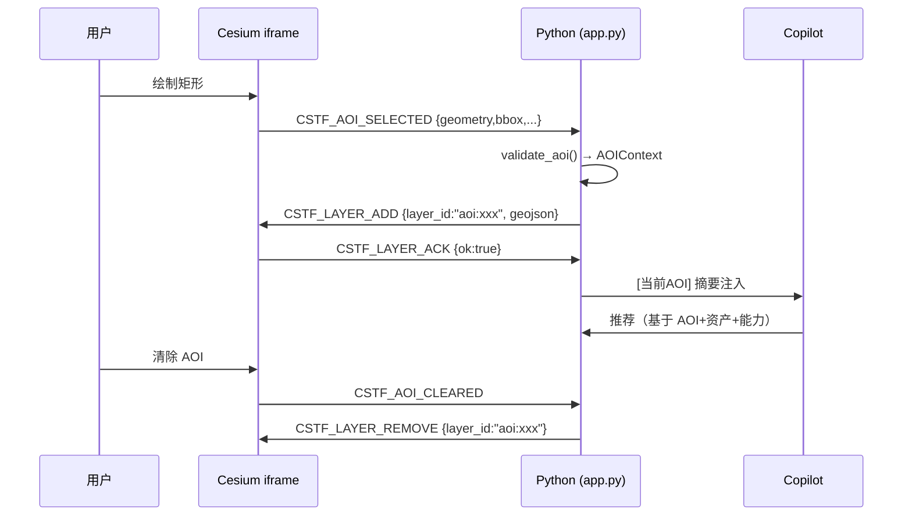

# 里程碑设计文档：地图控制闭环 · 动态能力状态 · 统一任务时间线 · AOI 双向交互 · PDF 报告

> 分支：`feature/map-capability-aoi-milestone`（基线 = `fix/p0-agent-hardening` 上 3 个 checkpoint）
> 范围：A→B→C→D→E 严格顺序，TDD 先行；**不改 M5/E1 算法**、不引入新 Agent 框架、不加数据库、不 push。
> 状态：设计定稿（实施中按阶段回填结果）

---

## 1. Cesium iframe 与 Viewer 生命周期（现状审计）

### 1.1 当前事实（来自代码审计）

| 事实 | 位置 |
| --- | --- |
| Viewer 每个 iframe 生命周期只创建一次，`window.__cstfViewerInitCount` 计数 | `globe_engine.py` JS |
| 初始相机 `applyCameraView("init")`：首次用 `setView(destination=rect)`（duration=0），其余用 `flyToBoundingSphere` | `globe_engine.py` JS |
| Agent 纯跳转：`_pending_camera_fly` → `components.html` 注入 JS → `postMessage(CSTF_FLY, "*")` → `navigateToLocation` | `app.py` L2901-2960 |
| iframe 缓存签名 `_cache_sig` **不含 center/zoom** → 纯跳转复用同一 iframe，不重建 Viewer | `app.py` L2804 |
| 图层/资产变更：`_globe_rev++` → 缓存签名变化 → **重建 iframe（重建 Viewer）** | `app.py` 多处 |
| 服务端：`globe_server.py` 内存 `_html_by_key` + 磁盘 `tempdir/yyglobe_html/{key}.html`，`_SERVER_VERSION` 控制服务重启 | `globe_server.py` |
| postMessage 发送方用 `targetOrigin="*"` | `app.py` L2921 |
| 无 READY 握手：iframe 加载完成前发消息靠 40×120ms 重试兜底 | `app.py` L2940 |
| 无 ACK：Streamlit 不知道飞行是否成功 | — |
| 无 ResizeObserver：Cesium 侧 RAF 轮询 + parent 侧 `syncWorkbenchHeight` 定时调整 | `globe_engine.py` / `app.py` |
| `camera.cancelFlight()` 在每次导航前调用；`lookAtTransform(IDENTITY)` 解锁相机 | `globe_engine.py` JS |
| `_lastNavKey` 去重（同坐标+range+pitch 忽略重复） | `globe_engine.py` JS |

### 1.2 Viewer 生命周期规则（设计目标）

1. **一个 iframe = 一个 Viewer**；Streamlit rerun 时只要缓存签名命中就不重建。
2. **默认中国视角只应用一次**：首次初始化 `setView`（duration=0）；后续 Home 按钮 / 预设走统一导航，绝不重建 Viewer。
3. **图层变更走协议（CSTF_LAYER_ADD/REMOVE）**，不再走「重建 iframe」；仅当**无活跃 iframe**（首次加载 / 强制刷新 / 服务版本变化）时才重建。
4. **新增 `CSTF_MAP_READY` 握手**：iframe 初始化完成（Viewer 就绪 + 底图加载 + 初始相机设置）后向 parent 发送，Streamlit 侧以此判定「可安全发命令」。
5. **`CSTF_FLY_ACK`**：每次飞行成功/失败均回 ACK（带 command_id），失败走 `CSTF_MAP_ERROR`。

### 1.3 消息协议 `CSTF_MAP_V1`

统一信封：

```json
{ "type": "CSTF_*", "version": 1, "command_id": "<uuid>", "ts": 1234567890, ...payload }
```

| 消息 | 方向 | 载荷 | 说明 |
| --- | --- | --- | --- |
| `CSTF_MAP_READY` | Cesium→parent | `{viewer_ready, imagery, camera}` | iframe 初始化完成，唯一一次（或断线重连后） |
| `CSTF_FLY` | parent→Cesium | `{command_id, lon, lat, height?, pitch?, heading?, duration?, preset?, label?, source?}` | 飞行；`preset` ∈ overview/region/point |
| `CSTF_FLY_ACK` | Cesium→parent | `{command_id, ok, camera?}` | 飞行结果 |
| `CSTF_LAYER_ADD` | parent→Cesium | `{command_id, layer_id, kind: geojson|imagery, data/url, alpha?, name?}` | 动态加图层，不重建 Viewer |
| `CSTF_LAYER_REMOVE` | parent→Cesium | `{command_id, layer_id}` | 移除图层 |
| `CSTF_LAYER_ACK` | Cesium→parent | `{command_id, ok, layer_id}` | 图层操作结果 |
| `CSTF_AOI_SELECTED` | Cesium→parent | `{aoi_id, geometry, bbox, centroid, area_km2, source, created_at}` | D 阶段 |
| `CSTF_AOI_CLEARED` | Cesium→parent | `{aoi_id?}` | D 阶段 |
| `CSTF_MAP_ERROR` | Cesium→parent | `{code, message, context?}` | 地图侧错误上报 |

- **command_id 幂等**：Cesium 侧维护最近 200 个 command_id，重复命令直接回 ACK 不重复执行。
- **有界队列**：相机队列只保留最新一条（`_lastNavKey` 语义升级为 command 级）；图层队列按 `layer_id` 去重。
- **targetOrigin**：A 阶段将发送方改为 `http://127.0.0.1:{port}` 精确源（保留 `"*"` 兼容远程演示开关，默认收紧）。

#### 1.3.1 地图定位字段与跨平台兼容矩阵

地图命令进入 Schema 前必须先归一化为以下 canonical 字段：

| 字段 | 类型/顺序 | 语义 |
| --- | --- | --- |
| `lat` | number，纬度 | canonical 中心纬度（-90～90） |
| `lon` | number，经度 | canonical 中心经度（-180～180） |
| `zoom` | integer，1～18 | canonical 缩放级别，缺省为 8 |
| `bounds` | `{west, south, east, north}` | 可选 WGS84 矩形，供相机 fit 使用 |

可选 canonical 相机字段还包括 `preset`、`label`、`height`、`duration`、`pitch` 和
`heading`；这些字段同样只能按 Schema 定义的类型进入命令。`location_name` 仅作为
本地预设解析的兼容输入，解析后不会进入 canonical map payload。

兼容输入包括 `center: [lat, lon]`、`center: {lat, lon}`（也接受
`latitude/longitude` 键）以及 `COMMAND_UPDATE_MAP|lat|lon|zoom` 管道文本。
它们只在适配边界消费；canonical 命令始终输出 `lat/lon/zoom`，进入 `CSTF_FLY`
时中心始终为 `lat/lon`（`zoom` 在 Python 侧转换为相机 `height`）。
`center + bounds` 是旧客户端的兼容输入，不是推荐输出；新生产者不得重新生成
`center` 别名或将其与 canonical 字段并列输出。

列表形式 `bounds` 的输入顺序固定为 `[[south, west], [north, east]]`；归一化后
固定为对象顺序 `west, south, east, north`，且必须满足 `west < east`、
`south < north`。无效 bounds 不得覆盖有效中心，记录 warning 后使用点位相机。

定位消息的最小时序为 **READY → FLY → ACK**：iframe 完成 Viewer/底图/初始相机
初始化后只发送一次 `CSTF_MAP_READY`；parent 收到 READY 后发送带同一
`command_id` 的 `CSTF_FLY`；Cesium 完成或拒绝飞行后必须回送
`CSTF_FLY_ACK {ok, command_id}`。超时只能表示“尚未确认”，不能当作成功；旧
iframe 仍可由有限重试兼容，但不得绕过 ACK 状态。

验收矩阵 `tests/acceptance/map_location_matrix.py` 固定覆盖四个输入：canonical
JSON、`center` JSON、`center + bounds` JSON 和 legacy 管道文本。矩阵同时检查
Python 合流状态与 READY/FLY/ACK 信封，并断言等价输入得到相同 canonical 中心，
矩形得到有效归一化 bounds。

#### 1.3.2 定位诊断症状映射

| 症状 | 优先检查 | 诊断含义/处理 |
| --- | --- | --- |
| 没有 READY | iframe URL、精确 `targetOrigin`、Viewer 初始化 | 地图尚未就绪或来源不匹配；等待 READY，超时仅保留 warning |
| 有 READY 但没有 ACK | `command_id`、`channel_id`、FLY 重试记录 | parent 已握手但 FLY 未被当前 iframe 接收；检查通道和重试是否匹配 |
| ACK 返回 `ok=false` | `lat/lon` 范围、Cesium 相机错误、`CSTF_MAP_ERROR` | 命令到达但导航失败；修正坐标/相机参数，不报告“已定位” |
| canonical 中心已更新但画面不动 | `_pending_camera_fly`、iframe 是否复用、ACK | Python 合流成功而浏览器侧未完成；检查 iframe 复用和 ACK，而非重新解析文本 |
| `bounds_valid=false` 或出现 invalid-bounds warning | bounds 顺序和范围 | 仅矩形增强无效；保留有效中心点飞行，不把 warning 当作中心失败 |

诊断展示只使用经过裁剪/四舍五入的临时投影（中心、缩放、bounds 有效性、READY/ACK
状态）；持久化日志不保存原始命令、完整坐标、路径或凭据。

### 1.4 相机预设（Python 侧常量，Cesium 侧实现）

| preset | 定义 | 高度 |
| --- | --- | --- |
| `overview`（中国） | `_CHINA_VIEW_RECT` {73,17,136,54}，中心 104E/36N | `china_range_m` 4_800_000 |
| `region`（杭州湾 120.8E/30.5N、乐清湾） | 命名位置表 | `region_range_m` 280_000 |
| `point`（任意坐标） | 由 lon/lat 确定 | `point_range_m` 90_000 |

- 命名位置（杭州湾/乐清湾/长江口/珠江口…）与坐标**分离存储**：`CAMERA_PRESETS = {"杭州湾": {"lat":30.5,"lon":120.8,"preset":"region"}, ...}`，避免把地名硬编码进坐标解析。
- 非法坐标（NaN/Inf/越界）→ **阻断**：不发送 CSTF_FLY，返回可读错误。
- 位置名在 Python 侧解析为坐标后仍走同一 `CSTF_FLY` 通道（preset 字段可选）。

### 1.5 图层与相机互不影响

- `CSTF_LAYER_ADD/REMOVE` 不重置相机、不重建 Viewer。
- 图层加载失败 → `CSTF_LAYER_ACK {ok:false}` + `CSTF_MAP_ERROR`，不影响相机状态。

---

## 2. Streamlit rerun 对 iframe 的影响

| rerun 类型 | 触发 | 对 iframe 的影响 | 处理 |
| --- | --- | --- | --- |
| 普通交互 rerun | 任意 widget | 缓存签名不变 → `components.iframe` 同 URL → **浏览器复用 iframe，Viewer 存活** | 无需处理 |
| 相机跳转 | `_pending_camera_fly` | 签名不变 → iframe 复用 → postMessage CSTF_FLY | 现有路径保持，升级为 READY 握手 + ACK |
| 图层/资产变更 | `_globe_rev++` 或 mtime 变化 | 签名变化 → iframe 重建 → **Viewer 重建（现状）** | 新路径：签名包含 `_globe_rev` 但**首帧不重建**，改用 `CSTF_LAYER_ADD`；仅当图层协议不可用/首载时重建 |
| 强制刷新（F5 / 新会话） | — | 全新 iframe | `CSTF_MAP_READY` 重发 |
| globe 服务重启 | `_SERVER_VERSION` 变化 | URL 端口变化 → `same_globe_origin` 失配 → 重建 | 保持现状 |

**关键约束**：`components.iframe` 在同一 rerun 内 URL 不变时，Streamlit 不会重挂载 iframe（React 组件 key 相同）。这是复用 Viewer 的基础——**任何写入 session_state 的相机状态变更不得修改缓存签名**（现状已满足，测试固化）。

**新增机制**：`st.session_state._globe_waiting_ready`：发 CSTF_FLY 前若 `_globe_ready_at` 缺失（从未收到 READY），先轮询等待（最多 3s），收到 READY 后再发；超时仍发送并记录 warning（兼容旧 iframe）。

---

## 3. Agent 地图命令调用链（现状 → 目标）

### 3.1 现状链

```
用户 → agent.py 工具(change_map_view / dispatch_system_command)
     → "[SYSTEM_COMMAND_JSON] {map:{lat,lon,zoom}} [/SYSTEM_COMMAND_JSON]"
     → agent_command_bridge.parse_system_command
     → queue_agent_command → flush_pending_agent_commands → apply_system_command
     → state["_pending_camera_fly"] = {lat, lon, zoom, source}
     → app.py 地图渲染区 components.html 注入 JS
     → postMessage(CSTF_FLY) → Cesium navigateToLocation
```

### 3.2 目标链（A 阶段增量，红色标注为新增）

```
用户 → agent.py 工具（同现状，新增 change_map_preset 工具可选）
     → [SYSTEM_COMMAND_JSON] {map:{lat,lon,zoom,preset?,label?}}
     → agent_command_bridge.parse_system_command（map 载荷增加 preset/label 透传）
     → apply_system_command → state["_pending_camera_fly"] = {lat, lon, zoom, preset, label, source, command_id}
     → app.py 地图渲染区：
         · 若 _globe_waiting_ready：等 READY（≤3s）
         · postMessage(CSTF_FLY {command_id,...})（targetOrigin 收紧）
     → Cesium：幂等检查 → cancelFlight → flyToBoundingSphere/lookAt → CSTF_FLY_ACK
     → app.py 收到 ACK → state["_globe_last_ack"]（UI 展示「地图已定位」/错误）
```

- `change_map_view` 增加 `preset: Optional[str]` 与 `label: Optional[str]` 参数（向后兼容：缺省走 point/zoom 语义）。
- `dispatch_system_command` 文档同步更新 map 载荷说明。

---

## 4. 动态能力状态（B：capability_registry.py）

### 4.1 数据结构

```python
@dataclass
class CapabilityStatus:
    capability_id: str          # map_navigation / map_layer_display / deep_learning_inference /
                                # gee_download / e1_quality_evaluation / m5_change_detection /
                                # autotune / pdf_report / knowledge_search
    label: str                  # 中文名
    status: str                 # AVAILABLE / CONDITIONAL / BLOCKED / UNAVAILABLE / UNKNOWN
    summary: str                # 一句话结论
    requirements: List[str]     # 依赖项（文件存在性等，不含绝对路径值）
    blockers: List[str]         # 阻断原因（可读，不含绝对路径）
    warnings: List[str]
    evidence: Dict[str, Any]    # 校验证据（布尔/版本号/大小，不存 token）
    recommended_actions: List[str]
    checked_at: str
    expires_at: str             # checked_at + TTL
```

### 4.2 状态判定

| 状态 | 判定 |
| --- | --- |
| `AVAILABLE` | 全部必要条件满足（如：模型文件存在、引擎可导入、目录存在） |
| `CONDITIONAL` | 满足但需用户配置/确认（如 GEE 需项目与代理、PDF 缺中文字体但有降级） |
| `BLOCKED` | 存在明确阻断（如模型路径不存在、引擎 import 失败） |
| `UNAVAILABLE` | 该能力在当前环境/配置下不启用（如未配置 GEE 项目） |
| `UNKNOWN` | 检查抛异常（吞掉堆栈，仅记录 message） |

### 4.3 检查分层（cheap / expensive）

- **cheap**（每次刷新）：引擎可导入（`importlib.util.find_spec`）、路径存在性、`.env` 关键键是否存在（只查键名不读值）、配置开关。
- **expensive**（TTL 缓存 60s，手动刷新可强制）：模型 `torch.load` 冒烟（仅读 state_dict 元信息，不加载权重）、GEE 可用性探测、localtileserver 可用性、网络代理可达性。
- **失效时机**：任务切换（`selected_task` 变化）、`model_path` 变化、手动「刷新」按钮、能力注册表 `bump()`。

### 4.4 安全

- 缓存中**绝不存 token/密钥/绝对路径值**：evidence 只存 `has_ion_token: bool`、`has_dashscope_key: bool` 这类布尔。
- 注入 Copilot 的摘要只含能力名/状态/一句话原因，**不含任何路径与密钥**。
- Agent 不能改写能力状态；**已 BLOCKED 的能力 Agent 不得声称执行成功**（在 prompt 与测试中固化）。

### 4.5 消费方

1. 侧栏可折叠「能力状态」面板（刷新按钮、无敏感路径）。
2. Copilot 系统提示注入：`available: [...], conditional: [...], blocked: [...], reasons: {...}`（字符串化，每次对话快照一次）。
3. D 阶段 AOI 推荐与 C 阶段时间线使用 `capability_registry` 判定前置条件。

---

## 5. 任务事件 / 时间线结构（C：扩展 agent_task_framework.py）

### 5.1 事件结构

```python
@dataclass
class TimelineEvent:
    event_id: str               # uuid4
    task_id: str                # 任务标识（task 名或任务唯一键）
    plan_id: Optional[str]      # 关联计划（M5/E1 plan 或 pipeline task id）
    tool: Optional[str]         # 触发工具（dispatch_system_command / confirm_and_run_m5 / 手动按钮）
    phase: str                  # PLAN / VALIDATE / CONFIRM / QUEUED / EXECUTE / VERIFY / REGISTER / MAP / REPORT
    status: str                 # PENDING / WAITING_CONFIRMATION / QUEUED / RUNNING / SUCCEEDED / FAILED / BLOCKED / CANCELLED / WARNING
    progress: Optional[int]     # 0-100
    message: str                # 人读文案
    details: Dict[str, Any]     # 结构化细节（不含敏感值）
    artifacts: List[str]        # 产物路径（相对路径或文件名，不含绝对路径）
    error: Optional[str]
    created_at: str
    updated_at: str
```

### 5.2 阶段语义（M5/E1 映射，保持现有行为不变）

| 阶段 | 触发 | 现有行为对应 |
| --- | --- | --- |
| PLAN | propose_m5/propose_e1/计划生成 | `_m5_pending_plan` / `_e1_pending_plan` |
| VALIDATE | 计划校验（readiness） | `TaskPlan.ready / blockers` |
| CONFIRM | 等待用户确认 | `_m5_plan_confirmed` / `_e1_plan_confirmed` / `_pending_heavy_confirm` |
| QUEUED | 已确认、线程排队 | `pending_task` 写入 |
| EXECUTE | 引擎运行 | `_pipeline_worker_entry` 等 |
| VERIFY | 结果校验 | `VerifyResult` / `m5_verification` / `e1_verification` |
| REGISTER | 资产登记 | `register_asset` / `assets_registry.json` |
| MAP | 地图加载 | `asset_override` / `_globe_rev` |
| REPORT | 汇报 | 写回 messages summary / PDF（E） |

**硬约束（保持现状）**：未确认不执行；失败不登记；验证必须是真实校验；回复由 ToolResult 驱动；同一计划只执行一次。

### 5.3 存储与恢复语义

- 存储：`session_state["_task_timeline"]`（事件列表）+ 磁盘 JSON ledger（`TF-agent/data/timeline_ledger.json`，原子写：临时文件 + `os.replace`）。**无数据库**。
- 恢复区分：
  - **rerun-restore**：同进程内状态自然保留，直接展示；
  - **refresh-restore**：从磁盘 ledger 恢复（`_timeline_restored_from` = "disk"）；
  - **process-restart-restore**：Streamlit 重启后 session_state 丢失，磁盘 ledger 仍在 → 恢复但 UI 标注「历史记录（进程重启后恢复）」，**不声称实时状态**。
- 状态机校验：非法迁移（如 SUCCEEDED→RUNNING）拒绝并记 WARNING。

### 5.4 UI

- 「任务时间线」区域（可在指挥台新增 tab/区块）：按时间倒序事件列表，阶段徽章 + 状态着色 + 进度。
- 重型门闩时间线：PLAN→WAITING_CONFIRMATION→（用户确认）→QUEUED→RUNNING→FAILED|SUCCEEDED；取消 → CANCELLED。

---

## 6. AOI 地图 → Python 消息协议（D：aoi_context.py + Cesium 侧）

### 6.1 AOI 结构

```python
@dataclass
class AOIContext:
    aoi_id: str                     # uuid4 或命名 id（稳定，图层 echo 复用）
    source: str                     # map_click / map_rectangle / map_polygon / current_view / asset_geometry / named_location
    geometry: Dict[str, Any]        # GeoJSON Polygon（EPSG:4326）
    bbox: Tuple[float,float,float,float]   # west,south,east,north
    centroid: Tuple[float,float]
    area_km2: float                 # 大地测量面积（不等积投影平面面积）
    crs: str                        # "EPSG:4326"
    valid: bool
    warnings: List[str]
    created_at: str
    label: Optional[str]
```

### 6.2 Cesium 侧工具（JS）

- 点选（click）：单点 → 生成小方框（±0.002°）AOI。
- 矩形：拖拽绘制 → 直接转 Polygon。
- 多边形：左键加点 / 右键闭合；**≥3 点**才生成；自动闭合环。
- 当前视图：`camera.computeViewRectangle()` → Polygon。
- 清除：移除 AOI entity；**不清除业务图层**（结果 SHP/TIF 图层不动）。

### 6.3 校验规则（Python 侧 `validate_aoi`）

- 坐标全部有限（拒绝 NaN/Inf）；顶点数上限（默认 2000，超出降采样并 warning）。
- 自相交：尝试 `make_valid()` 修复；修复失败 → warning + 保留原几何标记 invalid。
- 面积：**geodesic**（`geopandas` + `area` 或 `pyproj` 大地测量），禁止平面近似。
- 超大区域（> 省级）warning；跨 180° 经线 warning（不做切片，仅提示）。
- 拒绝规则：顶点数 < 3、面积 ≤ 0、bbox 越界 → `valid=False` + 可读错误。

### 6.4 Python → Copilot 上下文

- 注入格式（紧凑，**不含完整 GeoJSON**）：

```
[当前 AOI] id=xxx source=map_rectangle bbox=(120.6,30.2,121.2,30.9) centroid=(120.9,30.55) area_km2=3210 label=杭州湾北岸
```

- **AOI 选定 ≠ 确认执行**：仅提供空间上下文；任何推理/GEE/M5/E1 仍需原有确认门闩。
- 推荐逻辑 = AOI 摘要 + 任务资产（`dataset_assets`）+ `capability_registry`（如：AOI 命中数据集区域 → 推荐推理；GEE BLOCKED → 不推荐下载）。

### 6.5 AOI 地图回声（Cesium 侧）

- Python 收到 `CSTF_AOI_SELECTED` → 校验 → 保存 `_active_aoi` → 回发 `CSTF_LAYER_ADD {layer_id: "aoi:<id>", kind: geojson, data: 规范化几何}` 让地图高亮（**稳定 aoi_id**，重复选择同区域先 REMOVE 再 ADD，避免叠加）。
- **不重建 Viewer、不自动分析**。

---

## 7. Python → Copilot 上下文（B/D 共享）

| 上下文 | 格式 | 时机 | 敏感 |
| --- | --- | --- | --- |
| 能力摘要 | `[能力状态] 可用: map_navigation,map_layer_display,...; 受限: gee_download(需GEE项目); 不可用: pdf_report` | 会话开始/刷新后 | 无 |
| AOI 摘要 | `[当前AOI] ...` | AOI 变更时 | 无 |
| 资产摘要 | 复用现有 dataset 摘要（不新增） | 现有 | 无路径 |
| 时间线摘要 | `[最近任务] <task_id> <phase> <status>` | 任务完成/用户询问 | 无 |

- 所有注入内容**白名单字段**，禁止拼接原始 session_state。
- Copilot 提示词增加：不得声称执行了 BLOCKED 能力；AOI 仅作空间参考。

---

## 8. AOI 地图回声（见 6.5，此处汇总交互时序）



---

## 9. 缓存与过期（B 能力缓存 + 地图缓存）

| 缓存 | 键 | TTL | 失效 |
| --- | --- | --- | --- |
| 能力状态 | capability_id | cheap: 10s / expensive: 60s | 任务切换、model_path 变化、手动刷新、`bump()` |
| iframe HTML | `_html_by_key` + 磁盘 key | 进程内；磁盘无 TTL | `_SERVER_VERSION` 变化、新 key 发布 |
| 瓦片模板 | `_tile_templates` token | 进程内 | 服务重启 |
| AOI | `_active_aoi` | 会话内；AOI 清除/新 AOI 覆盖 | 显式 clear / 新选择 |
| 时间线 ledger | 磁盘 JSON | 无 TTL（历史） | 原子替换 |

- 能力缓存**不可持久化到磁盘**（进程重启后重新检查）。
- 时间线 ledger 上限（默认 500 事件），超出滚动截断（保留最近）。

---

## 10. 错误处理

| 场景 | 行为 |
| --- | --- |
| CSTF_FLY 非法坐标 | Python 阻断，`result.errors` 返回可读文案，不发送 |
| 未收到 CSTF_MAP_READY | 等待 ≤3s；超时发送并 `_globe_ready_warn=True`（UI 提示「地图可能尚未就绪」） |
| CSTF_FLY_ACK ok=false | `_globe_last_ack` 记录，UI 提示「地图跳转失败」 |
| 图层协议不可用（旧 iframe） | 回退重建 iframe（`_globe_rev++`），warning |
| 能力检查异常 | 该能力 UNKNOWN + message（无堆栈泄漏） |
| 时间线磁盘写入失败 | 仅内存记录 + warning，不中断任务 |
| AOI 校验失败 | valid=False + 原因；**不**回发图层，`CSTF_AOI_SELECTED` 的 ack 为 error |
| PDF（E） | 见第 14 节（E 阶段设计） |

---

## 11. 测试结构（TDD 先行，每阶段顺序：写失败测试 → 确认失败 → 最小实现 → 阶段测试 → 全量单测）

| 新测试文件 | 阶段 | 覆盖（规格项） |
| --- | --- | --- |
| `tests/unit/test_map_command_protocol.py` | A | 协议封装/解析、command_id 幂等、非法载荷阻断、targetOrigin 收紧、READY 等待逻辑 |
| `tests/unit/test_map_camera_presets.py` | A | 预设表（杭州湾/乐清湾/中国/点）、zoom→height 映射、坐标越界/NaN 阻断、地名-坐标分离 |
| `tests/unit/test_map_iframe_lifecycle.py` | A | 缓存签名不含相机字段、图层变更走协议 vs 重建分支、`same_globe_origin`、版本号逻辑 |
| `tests/unit/test_capability_registry.py` | B | 9 能力状态判定、cheap/expensive 分层、TTL/失效、异常→UNKNOWN、无敏感值、摘要白名单、Agent 不可改写 |
| `tests/unit/test_agent_task_timeline.py` | C | 事件结构、阶段机、门闩时间线、恢复语义（rerun/refresh/restart）、原子写、上限截断、M5/E1 映射 |
| `tests/unit/test_aoi_context.py` | D | AOI 结构、校验（NaN/顶点/自相交/面积/跨经线）、geodesic 面积、来源分类 |
| `tests/unit/test_aoi_map_bridge.py` | D | AOI→图层 echo、稳定 aoi_id、清除≠删业务层、注入摘要白名单、选定≠确认 |
| `tests/unit/test_pdf_report.py` | E | 适配器成功/失败、文件存在非空、同任务去重、截图失败降级、中文字体错误、无 token/绝对路径 |

- 每阶段新增后运行 `pytest tests/unit -q --tb=short -p no:cacheprovider`（必须 ≥ 基线 69 且全绿）。
- A–D 完成后跑 E2E（`tests/e2e/run_diagnostics.py` 13 项）与压力（`tests/stress/run_ux_stress.py` 5 项）。
- **禁止 mock 测试结果**：断言必须落在真实实现上。

---

## 12. 各阶段修改文件清单

| 阶段 | 新增 | 修改 |
| --- | --- | --- |
| A | `tests/unit/test_map_command_protocol.py`、`test_map_camera_presets.py`、`test_map_iframe_lifecycle.py`；`TF-agent/map_protocol.py`（协议封装/校验/预设，纯 Python 可测） | `globe_engine.py`（JS：READY/ACK/LAYER 协议、targetOrigin、preset）、`globe_server.py`（如需）、`agent_command_bridge.py`（map 载荷 preset/label 透传）、`app.py`（READY 等待、ACK 展示）、`agent.py`（change_map_view 扩展 + prompt） |
| B | `TF-agent/capability_registry.py`；`tests/unit/test_capability_registry.py` | `app.py`（侧栏面板 + 注入）、`agent.py`（能力上下文注入） |
| C | `TF-agent/task_timeline.py`（事件/状态机/ledger）；`tests/unit/test_agent_task_timeline.py` | `agent_task_framework.py`（复用/扩展常量）、`app.py`（时间线 UI + 埋点）、`agent_command_bridge.py`（门闩事件） |
| D | `TF-agent/aoi_context.py`；`tests/unit/test_aoi_context.py`、`test_aoi_map_bridge.py` | `globe_engine.py`（JS 绘制工具）、`app.py`（AOI 处理/注入）、`map_protocol.py`（AOI 消息）、`agent.py`（AOI 上下文） |
| E | `TF-agent/report_generator.py`；`tests/unit/test_pdf_report.py` | `app.py`（报告入口）、`agent.py`（可选 report 工具） |

---

## 13. 向后兼容

- `CSTF_FLY` 旧载荷（无 command_id/preset）继续接受，回 ACK 时 command_id 可为空。
- `change_map_view` 旧签名（location_name, lat, lon, zoom）继续可用（preset/label 可选）。
- `_cache_sig` 增加字段时保留旧字段顺序 → 旧会话缓存失效一次可接受（幂等重建）。
- M5/E1 闭环行为零改动：propose→confirm→run 链路、未确认不执行、失败不登记、单次执行。
- 2D 回退路径（`_use_2d`）不受影响。
- 能力注册表、时间线、AOI 全部**可选挂载**：任何异常不得阻塞地图/任务主流程（try/except + warning）。

---

## 14. E 阶段（PDF 报告最小接入）设计 —— 仅当 A–D 全通过后实施

### 14.1 前置门槛
- A–D 阶段测试 + 原 69 单测全绿；E2E/压力无回归；无严重架构问题。否则 **SKIP 并在最终报告说明原因**。

### 14.2 现状审计（10 问）
1. 代码库现有 PDF/报告相关：`grep -ri "reportlab|weasyprint|fpdf|pdf|report|template|export"`（预期：assets_registry/日志中仅有 report 字样，无生成器）。
2. 依赖：requirements.txt 无 reportlab/weasyprint。
3. HTML→PDF 方案：**reportlab**（纯 Python，无系统依赖）为第一候选；weasyprint 需 GTK 不选。
4. 中文字体：Windows `C:/Windows/Fonts/msyh.ttc`（微软雅黑）探测；缺失 → 清晰错误/降级（仅英文+数字）。
5. 数据来源：仅真实数据（timeline + capabilities + assets + 任务结果），禁止编造。

### 14.3 适配器接口

```python
def generate_task_report(
    task_context: dict,       # task_id, task, mode, prob, cnt, plan_id
    capabilities: CapabilitySnapshot,   # 能力摘要（无敏感）
    timeline: List[TimelineEvent],      # 事件列表
    assets: List[dict],                 # 资产登记（相对路径）
    map_snapshot: Optional[bytes] = None,  # 地图截图（可失败）
) -> ReportResult:
    # ReportResult { success, task_id, report_path, sections: List[str], warnings: List[str], error }
```

### 14.4 规则
- 流程：PLAN→CONFIRM→EXECUTE→VERIFY→REPORT（复用 C 阶段事件）。
- 生成后校验：文件存在且非空；否则 FAILED 不登记。
- 同 `task_id + 配置哈希` 去重（已存在且 mtime 新 → 返回已有路径）。
- 截图失败 → warning，报告仍生成（占位说明）。
- 中文字体缺失 → 明确错误/降级。
- **无 token、无本地绝对路径**（路径转相对）。
- 报告入口：任务完成后「生成 PDF 报告」按钮 + Copilot 可选工具（E 阶段若 Agent 接入）。

---

## 自查清单（设计期逐项核对）

- [x] 无 TODO/TBD 残留（全部章节给出确定设计）
- [x] 无重复状态源：能力/时间线/AOI 各自单一所有者；相机状态仍由 session_state.map_center 唯一驱动
- [x] rerun 复用 iframe 依赖缓存签名不含相机字段（有测试固化）
- [x] 事件不混合：TimelineEvent 与 pipeline_shared 的 status/progress 并存但单向同步（时间线只读消费）
- [x] 密钥不落缓存/不注入（evidence 布尔化、白名单摘要）
- [x] M5/E1 行为零改动（门闩、验证、单次执行保持）
- [x] 目标 origin 收紧方案明确（A 阶段实现，保留远程演示开关）
- [x] Cesium Token/图层性能不在本里程碑（剩余问题清单）
- [x] 每阶段有独立 checkpoint commit 计划（见进度文档）
- [x] 浏览器验收 5 场景可在本地 8501 执行（Streamlit 运行中）
