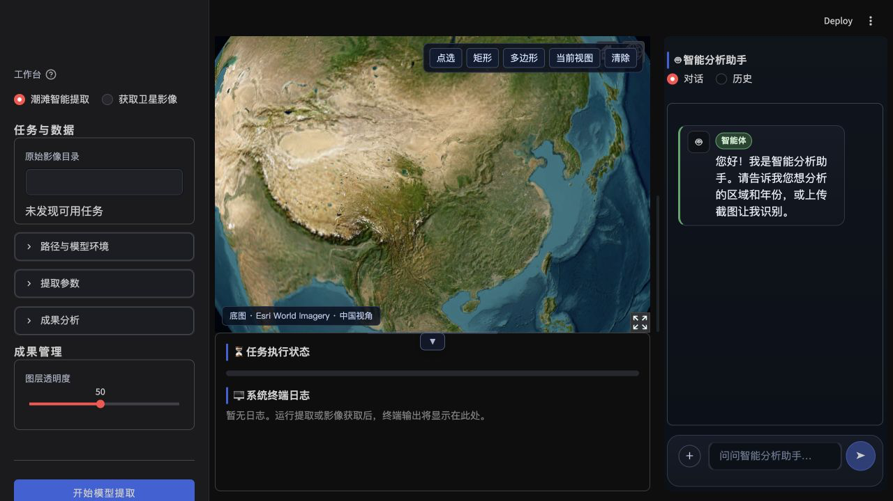
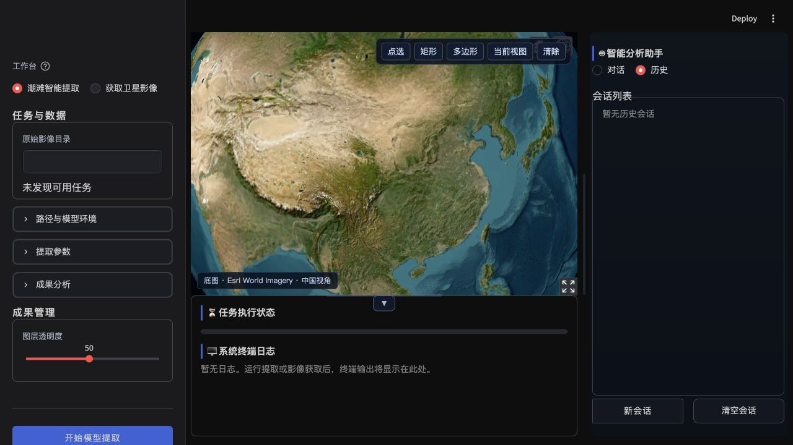
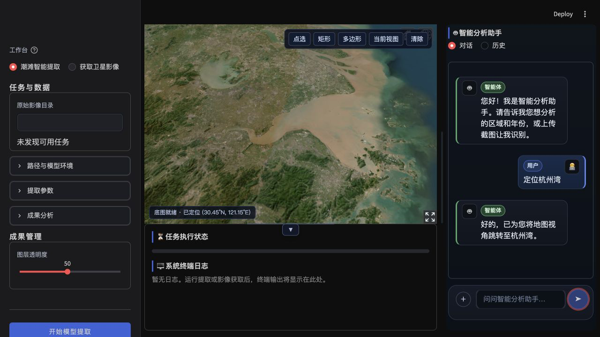
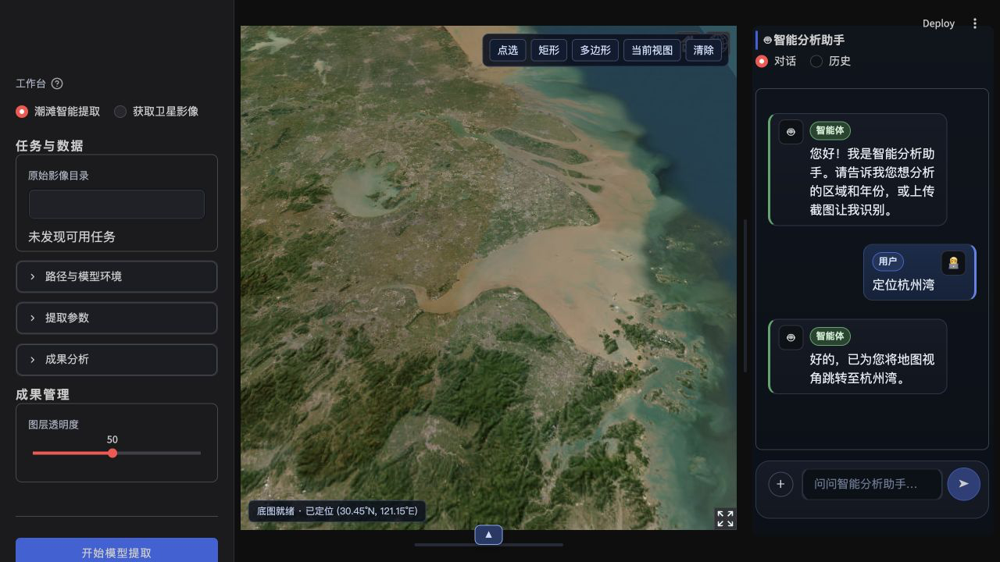
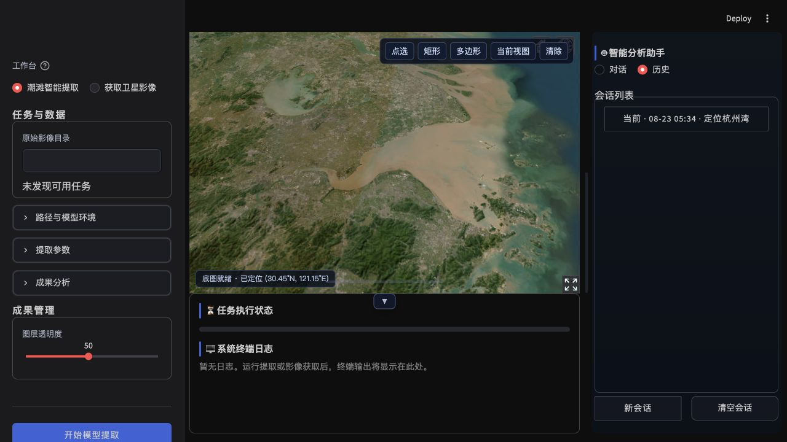

# TF-agent 项目功能审查报告

- 审查日期：2026-08-23（Asia/Shanghai）
- 审查对象：`/Users/chl/Codespace/TF-agent`
- 分支 / 基准提交：`main` / `1dc08ba`
- 运行环境：macOS，Conda `tf-agent`，Python 3.10.20，Streamlit 1.62.0
- 审查性质：当前未提交工作树快照；工作区已有大量用户修改，本次未改动业务代码

## 1. 执行摘要

项目当前可以启动，主界面、Cesium 地图、Agent 对话、历史列表、面板伸缩与状态区折叠的基础路径可用。完整离线测试为 **625 passed / 3 skipped**，离线验收矩阵为 **205 passed**，Python 编译与依赖一致性检查也通过。

但测试绿色尚未覆盖多用户隔离和 Workflow 的关键执行不变量。本次确认 **14 项功能缺陷**：

| 严重级别 | 数量 | 主要影响 |
|---|---:|---|
| P1 高 | 8 | 跨用户数据串线、未经执行边界确认即可运行、重复执行、取消/恢复失真、任务收尾停滞、附件功能不可用 |
| P2 中 | 5 | 会话丢失、用户意图不生效、浏览器脚本生命周期错误、敏感文件名持久化、血缘缺失 |
| P3 低 | 1 | 上下文预算超限 |

未确认 P0 阻断级故障。另记录 5 项风险或尚未完成的外部验证，不与已确认缺陷混计。

## 2. 审查范围与方法

### 2.1 覆盖范围

- Agent：对话、附件、上下文预算、会话持久化、外部模型数据门禁。
- UI：地图、Agent Dock、历史列表、通知、面板伸缩、状态/日志抽屉。
- Workflow：构建、确认、参数冻结、执行、取消、资源互斥、恢复、血缘。
- 运行底座：ExecutionRequest、JobStore、SQLite、AOI 地图桥接。
- 验证：单元/验收测试、编译、依赖检查、真实浏览器流程与控制台。

### 2.2 严重级别

- **P1**：可能导致隐私越界、错误执行、重复重型任务、不可恢复状态或核心功能失效，应优先修复。
- **P2**：功能结果错误、可恢复的数据丢失、关键可观测性或生命周期缺陷。
- **P3**：低风险的预算、性能、可访问性或一致性问题。

### 2.3 已执行验证

| 验证项 | 结果 |
|---|---|
| `python -m pytest -q --tb=short -p no:cacheprovider` | 625 passed，3 skipped，2 warnings，20.78s |
| `python -m compileall -q TF-agent` | 通过 |
| `python -m pip check` | `No broken requirements found.` |
| 离线验收矩阵 | 205 passed，6.78s；矩阵整体 PASS |
| 浏览器验收 | 根页面、历史、对话、地图定位、宽度键盘调整、状态区折叠/展开均完成 |
| 浏览器控制台 | 捕获 1 个当前页面 JavaScript 错误 |

`tests/browser` 的 3 项自动化浏览器用例是显式 opt-in，因此本次官方 pytest 结果为跳过；已用真实浏览器补充主路径验证。

## 3. 已确认缺陷

### F-01 [P1] 会话历史没有用户/网关会话归属隔离

**影响**：共享部署中，用户 B 可以列出、读取或删除用户 A 的会话；与附件文件名问题叠加时会放大隐私泄露。

**证据**：

- `TF-agent/conversation_store.py:129-142` 的 `sessions` 表没有 `user_id`、`session_id` 或 owner 字段。
- `TF-agent/conversation_store.py:232-305` 的读取、列表和删除仅按 `thread_id` 操作。
- `TF-agent/app.py:4718-4725` 对所有 Streamlit 会话使用同一数据库路径；`4768-4775` 直接列出全库线程。
- 临时 SQLite 复现中，第二个客户端实例能列出 `thread_A` 并读取 `A-private-chat`。

**建议方案**：从已认证网关会话派生不可逆 owner 标识，所有增删改查强制携带 owner；数据库增加复合唯一键和迁移；增加 A/B 双会话负向测试。不要持久化原始认证令牌。

### F-02 [P1] AOI 地图事件通过进程级全局队列跨会话串线

**影响**：用户 B 可能收到用户 A 绘制的几何范围，污染地图和 Agent 空间上下文，并泄露位置数据。

**证据**：

- `TF-agent/globe_server.py:29-37,72-89` 使用全局 `_MAP_STATE`，事件没有用户或会话维度。
- `take_aoi_pending()` 是按全局序号的非破坏读取。
- `TF-agent/globe_engine.py:1281-1288` 发送 AOI 时没有会话通道标识。
- 隔离进程复现中，A、B 从序号 0 轮询时均得到同一 `seq=1` 点几何。

**建议方案**：为 iframe 和 Python 端建立短期、不可猜测的会话通道；AOI 队列按 owner/channel 分区并设置 TTL；严禁把精确几何作为跨会话持久状态。

### F-03 [P1] Workflow 核心执行器缺少最终审批和参数不可变门闩

**影响**：直接调用核心执行器时，`PENDING + confirmed=False`、已取消 Workflow、或确认后被改写的参数仍能执行下载、推理和报告步骤。

**证据**：

- `TF-agent/workflow_orchestrator.py:1471-1495` 只特殊处理 `PAUSED`，随后无条件切为 `RUNNING`。
- 参数变化只在已经是 `PAUSED` 时检查，见 `1486-1510`。
- 独立复现：未确认、已取消、确认后把 `target_year` 从 2024 改为 2025 的三种计划均执行 `gee_download → local_inference → pdf_report`。
- 仓库未实现 `approved_spec_hash` / revision 的执行时校验。

**边界说明**：`TF-agent/agent_command_bridge.py:1355-1389` 的正常 Agent 入口目前有前置确认和参数检查，因此本次没有证明常规按钮路径会直接绕过；问题在于安全不变量没有落在最终执行边界，其他调用者、恢复路径或竞态仍可绕过。

**建议方案**：执行器入口必须原子校验 `confirmed`、状态、批准版本和规范哈希；确认后冻结 canonical execution spec；任何参数、AOI、步骤或输出目录变化都生成新 revision 并重新确认。

### F-04 [P1] 取消发生在步骤执行中时，当前步骤仍可成功并登记资产

**影响**：界面显示 Workflow 已取消，但当前步骤可能被标记成功、写入 asset，造成状态与实际副作用不一致。

**证据**：

- `TF-agent/workflow_orchestrator.py:1497-1502` 只在步骤开始前检查 stop event。
- `1524-1547` 在执行器返回后直接提交状态和资产，没有再次检查取消。
- 复现中 GEE override 在执行中设置 stop event 后返回 success；最终 Workflow 为 `CANCELLED`，但 `gee_download=SUCCEEDED` 且存在 `asset_gee_download`。
- E1/M5 的闭包没有把 stop event 传入底层引擎，PDF 生成也没有统一取消参数。

**建议方案**：在副作用前、执行返回后、资产登记前各检查取消；把“取消后迟到的成功”定义为不可提交；所有引擎使用统一 cooperative cancellation 契约，并对无法撤销的远端任务记录 task ID 和补偿状态。

### F-05 [P1] 同一 Workflow 可形成两个可认领 Job，重型资源互斥未生效

**影响**：同一任务可能重复下载、重复推理、重复生成报告；两个 Workflow 也可能争用 GPU、GEE 配额或同一输出目录。

**证据**：

- Workflow pending 只有 `workflow_id`，见 `TF-agent/agent_command_bridge.py:1385-1390`。
- `TF-agent/execution_request.py:95-96` 只从 `plan_id` 生成幂等身份，没有回退到 `workflow_id`。
- `TF-agent/app.py:2116-2121` 因而向 JobStore 写入空 `plan_id`。
- 临时 JobStore 复现中，同一 `workflow_id` 形成两个不同 request ID、两个 `plan_id=null`，两项均可成功 claim。
- `TF-agent/workflow_orchestrator.py:641-644` 计算 `running_heavy` 后未使用；复现中已有重型步骤 RUNNING 时仍返回另一个重型步骤 READY。

**建议方案**：把 `workflow_id + approved revision` 作为稳定幂等键并加数据库唯一约束；执行前原子 claim Workflow；增加按 GPU、GEE project/account、工作目录和输出目录的 resource claim。

### F-06 [P1] Workflow 恢复账本丢失上下文、DAG 和批准参数

**影响**：若启用恢复，重启后原依赖顺序、required、条件、用户意图和批准参数均丢失，所有步骤可能同时 READY，不能安全续跑。

**证据**：

- `TF-agent/workflow_orchestrator.py:2008-2033` 的账本仅保存 tool、status、plan ID 和 asset ID。
- `2046-2080` 恢复时写死 `context={}`、空依赖、`required=False`、`approved_params=None`。
- 独立复现与上述结果一致。
- 生产源码没有调用 `load_workflow()`；当前恢复能力只在测试中使用，实际应用仅恢复 JobStore 的中断标记。

**建议方案**：持久化版本化的 canonical Workflow/TaskContract、完整 DAG、intent、批准规范哈希和资源声明；恢复时校验 schema/checksum，无法证明一致时只能进入 `INTERRUPTED/WAITING_CONFIRMATION`，不得自动续跑。

### F-07 [P1] 折叠状态/日志区会停止后台任务监控和完成收尾

**影响**：折叠后启动或运行任务，进度、成果加载、聊天摘要和 Job 终态可能不更新，`is_running` 可能长期保持真，直到重新展开。

**证据**：

- `TF-agent/app.py:4693-4695` 只有展开时才创建 `_log_panel_slot`。
- `6536-6548` 虽然始终启动 worker，但只有 slot 存在时才调用 fragment monitor。
- `6159-6200` 的 monitor 同时承担完成收尾、状态迁移和进度渲染；fragment 可用时没有整页 rerun 兜底。

**验证边界**：这是确定的控制流缺陷；为避免触发真实 GEE/GPU 长任务，本次没有进行外部任务端到端复现。

**建议方案**：把“任务状态轮询/收尾”和“面板渲染”解耦；monitor 始终运行，折叠只决定是否渲染内容。增加“折叠后启动 → worker 完成 → Job 终态/成果仍更新”的 AppTest/浏览器用例。

### F-08 [P1] 附件入口可见，但当前 UI 永远拒绝附件

**影响**：用户点击 `+` 选择 PNG/JPG/WebP/TIFF 后，附件会被丢弃；界面提示去不存在的“会话设置”授权，形成明显的虚假可用入口。

**证据**：

- `TF-agent/app.py:4746-4750` 每次渲染都把媒体和空间授权强制重置为 false。
- `5019-5022` 未授权时直接清空上传对象。
- `5233-5239` 调用模型时仍传入 false；`TF-agent/agent.py:971-975` 再次拒绝。
- 当前 UI 没有任何可达控件把两项授权设置为 true。

**建议方案**：采用发送前的显式、单次授权：外部媒体与精确空间元数据分开确认；默认本地预览，不自动外发。若当前产品不支持该流程，应禁用/隐藏附件入口并给出明确原因，而不是接受选择后静默丢弃。

### F-09 [P2] 删除最后一个会话后继续聊天，新消息不会持久化

**影响**：删除全部会话后仍可进入对话并发送，但刷新后消息消失。

**证据**：

- `TF-agent/app.py:4841-4844` 删除最后一个线程后把 `_conversation_thread_id` 设为 `None`。
- 对话输入仍可提交并写入 session_state。
- `6959-6969` 只有 thread ID 非空时才调用 `replace_messages()`。

**建议方案**：删除最后线程时保留“无选中会话”状态，但首次发送前原子创建新线程；或删除后立即创建替代线程。增加“删最后一条 → 发送 → 刷新恢复”的集成测试。

### F-10 [P2] `need_report=False` 被忽略，PDF 步骤仍执行

**影响**：用户明确不需要报告时仍消耗时间和资源生成 PDF。

**证据**：

- `TF-agent/workflow_orchestrator.py:285-289` 只把 `need_report` 写入 intent。
- `235-249` 总是创建 required PDF 步骤。
- `_should_skip()`（`687-698`）不处理 `report_required`。
- override 复现中 `need_report=false` 仍调用 `pdf_report`。

**建议方案**：构建 DAG 时根据 intent 设置 required/condition，或在 `_should_skip()` 明确处理 `report_required`；添加 true/false/auto 三态测试。

### F-11 [P2] 父页面 MutationObserver 使用错误 Realm，浏览器控制台持续报错

**影响**：通知绑定、布局默认值同步和状态三角状态观察器可能在脚本中途停止，Streamlit 替换 DOM 后出现控件失联或通知不可关闭。

**证据**：

- `TF-agent/app.py:6550-6707` 从组件 iframe 中取得 `window.parent.document`，但使用 iframe Realm 的 `new MutationObserver()` 观察父 Realm 的 `doc.body`。
- 真实浏览器控制台捕获：`Failed to execute 'observe' on 'MutationObserver': parameter 1 is not of type 'Node'.`
- 同文件附件脚本已采用 `win.MutationObserver || MutationObserver`，说明可使用父窗口构造器修正。

**建议方案**：统一使用 `new win.MutationObserver(...)`，并在注册后做断言/降级；每类 observer 和 resize listener 都使用可重入 guard；添加控制台零错误的浏览器验收。

### F-12 [P2] 附件文件名没有敏感信息清理

**影响**：虽然不保存附件二进制，但包含 token、路径片段或密钥的文件名会原样进入 SQLite；与 F-01 叠加后可跨用户暴露。

**证据**：

- `TF-agent/conversation_store.py:200-206,219-227` 仅取 basename，没有使用内容脱敏策略。
- 临时数据库复现后重新读取，仍得到合成值 `api_key=EXAMPLE_ONLY.png`。

**建议方案**：持久化随机 attachment ID 或经过策略清洗的显示名；敏感模式命中时只保留扩展名；增加文件名密钥、绝对路径、Unicode 和超长输入测试。

### F-13 [P2] Workflow 资产血缘不会在生产执行路径自动记录

**影响**：无法可靠追溯 `workflow → dataset → prediction → report`，失败恢复、审计和成果复用缺少来源链。

**证据**：

- `record_workflow_lineage()` 仅定义于 `TF-agent/workflow_orchestrator.py:1881-1906`。
- 仓库调用点只存在于单元/验收测试。
- `TF-agent/app.py:1560-1574` 的生产 `exec_ctx` 也没有传入 `workflow_id`。

**建议方案**：每个成功资产注册后幂等写入 lineage；把 workflow ID、批准 revision、父资产和工具版本贯穿各 registry；失败时保留不含路径/密钥的诊断标识。

### F-14 [P3] `bound_messages()` 在首条为 system 时超过 `max_messages`

**影响**：上下文条数预算失真，极端情况下增加 token 成本并挤出预期的近期消息。

**证据**：

- `TF-agent/context_budget.py:17-20` 先保留 system，再追加最近 `max_messages` 条。
- 最小复现配置 `max_messages=4`，实际返回 5 条。

**建议方案**：把 system 条目计入总额度，例如尾部只取 `max_messages - len(head)`；补充 system、字符截断和最小额度边界测试。

## 4. 风险与验证缺口

下列项目有源码证据，但因当前 UI 路径阻断或本次不触发真实外部副作用，单列为风险，不计入 14 项确认缺陷：

1. **GeoTIFF 空间元数据风险**：核心函数在允许媒体、禁止空间元数据时，12 MB 以下 TIFF 仍可能以原始二进制 base64 发送，TIFF 标签中的 CRS/bounds 不会被文本脱敏覆盖。建议禁止原始 GeoTIFF 外发，先本地转为去元数据 PNG/JPEG。
2. **通知关闭不持久**：当前关闭只设置 DOM `display:none`；fragment 再次输出同一错误后可能重现。建议把 dismissal key 存入 session_state，并按事件 ID 去重。
3. **resize 监听器累积**：`TF-agent/app.py:6939-6940` 每次组件脚本执行都新增 listener，没有全局 guard，长期 rerun 后可能重复布局计算。
4. **低高度/移动端裁剪与可访问性**：页面强制 `overflow:hidden` 且工作区最小高度 480px；两个 separator 缺少 `aria-valuenow/min/max`，屏幕阅读器无法获知当前尺寸。
5. **外部能力未实测**：未执行真实 GEE、模型权重/GPU 推理、影像下载、PDF 长任务、远端模型网关或 destructive conversation deletion；这些仍需在隔离测试数据和受控账号下完成。

## 5. 浏览器流程审查

### 总体健康度

桌面 1280×720 视口下，布局层级清楚，地图和 Agent 可并列使用，历史视图已不再显示聊天输入区或底部空白行，用户/助手消息方向清楚。地图定位、Agent 宽度键盘调整、状态三角折叠/展开均可操作。主要可见风险是父页面 observer 报错，以及状态区折叠与后台监控耦合。

### 步骤 1：根页面与三栏工作台

结果：通过。工作台、地图、Agent 和状态/日志区同时可见。

### 步骤 2：空历史视图

结果：通过。历史只显示会话列表和操作按钮；未复现旧版聊天框、发送框或额外空白行。

### 步骤 3：Agent 发送“定位杭州湾”

结果：通过。Agent 返回定位成功，地图状态为 `已定位 (30.45°N, 121.15°E)`；本次没有复现“定位后地图下方状态/日志区消失”。

### 步骤 4：折叠状态/日志区

结果：视觉与控件状态通过。三角按钮位于地图/状态分界线中部，展开/折叠的文本和方向正确。功能层仍存在 F-07：折叠会让 monitor 不再执行。

### 步骤 5：历史中恢复当前会话

结果：单浏览器内通过。定位对话出现在历史列表；但跨用户安全性不通过，见 F-01。

## 6. 当前实现的可靠部分

- 当前根页面可启动，地图/Agent/状态区的基础布局正常。
- “定位杭州湾”对话和地图定位闭环成功，状态/日志区在该路径保持可见。
- 空历史视图没有聊天发送区和额外空白行；两个底部按钮填满可用宽度。
- Agent 垂直分隔条支持鼠标拖拽与方向键，实际宽度和 URL 参数会同步变化。
- 状态三角能在展开/折叠时翻转，位置符合当前设计。
- 单个 JobStore job 的原子 claim、SQLite 损坏保护、文本内容脱敏和离线测试基线表现良好。

## 7. 修复优先级与实施顺序

### 第一阶段：安全与执行边界（P1，先完成）

1. 会话和 AOI 都增加 owner/channel 隔离，补 A/B 双会话负向测试。
2. 建立版本化 TaskContract / approved spec hash，最终执行器原子校验确认、revision 和状态。
3. Workflow 使用稳定幂等键与资源 claim；取消后迟到成功不可提交。
4. 账本持久化完整 DAG 和批准快照；不满足恢复条件时只允许人工重新确认。

### 第二阶段：任务监控与附件闭环

1. monitor 永远运行，面板折叠只控制渲染。
2. 实现附件的本地预览与发送前显式授权；分离媒体和空间元数据权限。
3. 删除最后会话后，首次发送自动创建并持久化新线程。

### 第三阶段：意图、可观测性与 UI 生命周期

1. 修复 `need_report` 条件和 Workflow 血缘自动记录。
2. 修复跨 Realm MutationObserver、通知去重和 resize listener guard。
3. 修复上下文预算、separator ARIA 和低高度视口降级。

### 第四阶段：外部验收

在隔离账号和样例数据上依次执行：GEE 小区域下载、单张本地推理、取消中步骤、进程重启恢复、PDF 生成、远端模型媒体授权；全过程验证无密钥、绝对路径、原始影像或精确空间元数据被意外持久化/外发。

## 8. 验收门槛建议

修复完成前，不建议把当前实例作为多用户远程服务开放。至少满足以下条件后再进入远程试用：

- A/B 两个认证会话不能互见会话、AOI、任务、资产或通知。
- 未确认、已取消、旧 revision 的 Workflow 在最终执行器入口均被拒绝，且没有任何外部副作用。
- 同一 Workflow 并发提交只产生一个可执行 Job；GPU/GEE/输出目录资源冲突可确定性排队或拒绝。
- 折叠状态面板不影响任务进度、完成收尾和成果加载。
- 附件必须在用户明确授权后才外发；禁止原始 GeoTIFF 携带空间标签外发。
- 浏览器控制台无未处理错误，完整自动化与外部 smoke test 通过。

## 9. 审查证据

- [离线验收矩阵](ui-audit/functional-audit-2026-08-23/acceptance_matrix.json)
- [浏览器控制台](ui-audit/functional-audit-2026-08-23/browser_console.json)
- [会话、AOI、上下文与重复 Job 复现](ui-audit/functional-audit-2026-08-23/reproduction_storage.json)
- [Workflow 状态、取消、恢复与条件复现](ui-audit/functional-audit-2026-08-23/reproduction_workflow.json)

本报告只描述当前审查快照。由于工作树未提交且后续代码可能继续变化，修复验证时应重新记录 commit、测试结果和浏览器证据，不能用本次通过结果替代未来版本的验收。

## 10. 本轮优化回执（2026-08-23）

已按本报告执行除 F-01（会话历史用户/网关归属隔离，按用户要求暂不处理）之外的高优先级修复：Workflow 确认与 revision/hash 门禁、取消后的迟到成功抑制、重型步骤跨 Workflow 串行化、完整账本恢复、报告条件跳过、折叠状态区继续监控、附件单轮显式外发授权、末尾会话惰性重建、AOI channel 隔离、附件文件名脱敏、上下文条数预算、血缘自动记录及前端 resize/观察器容错。

同时补齐了风险项中的 GeoTIFF 外发保护（外部模型边界强制转换为无空间标签 PNG）、通知关闭的 sessionStorage 记忆和尺寸分隔条 ARIA 值。验证结果：全量 `pytest` 为 639 passed、3 skipped；本地 `http://127.0.0.1:8501/` 可渲染地图、Agent、加号附件入口、发送按钮和状态区三角按钮。最新浏览器新标签页及折叠操作均无控制台错误。F-01 仍保留为后续多用户部署前的独立任务。
